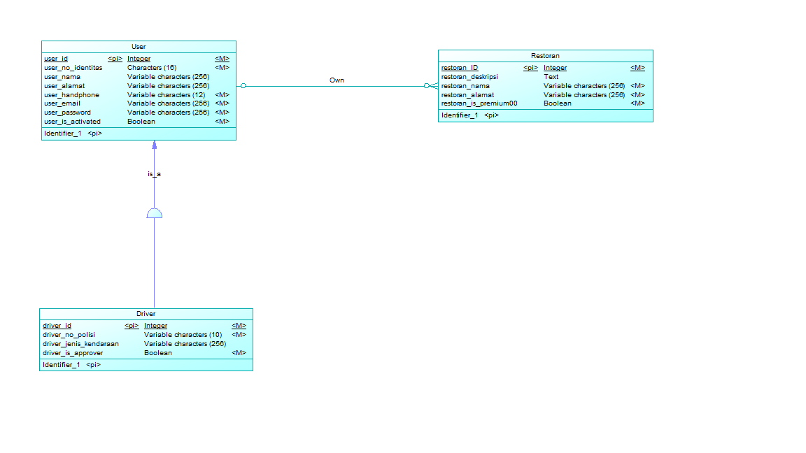

# API Documentation
```
Name :
Firman Maulana - 05111640000059
Affan Ghaffar -  05111640000121
Ananda Afryan -  05111640000147
```
# Data Model
## CDM

## PDM


# Developers
> Base Endpoint : https://rendoru.com/kuliah/pbkk
This service provide an implementation of OAuth2 standard. Please use the password grant, and refresh token grant inorder to obtain your access key. Read more about password grant here : https://www.oauth.com/oauth2-servers/access-tokens/password-grant/. Please use basic authentication to access our token endpoints. 
```
***host*** might be replaced with something else
host/oauth/token        //For retreiving your token
host/oauth/check_token  //For resources server that wants to check given token
```
Here is some diagrams for you :>. But please skip the user login form part since we just provide an API Endpoint. 


There are 3 possible prefix that is required depending on which user's resources that you want to access.

```
Prefixes :
user_ : for user based access. Just like the dummy user account.
restaurant_ : for restaurant based access.
driver_ : for driver based access.
```

Example of Request
```
URL : https://rendoru.com/kuliah/pbkk/oauth
====Header====
client_id = [your_client_id]
client_password = [your_client_password]

key = client_id:client_password
base64Key = [base64 of key above]

Authorization : Basic base64Key

=====Post Body===== 
(URL Encoded Form)
grant_type = password
username = [prefix_][username] // Ex. user_customer
password = [password]
```

Example of Token Verification :
```
URL : https://rendoru.com/kuliah/pbkk/oauth/check_token
====Header====
Authorization : Bearer [your_access_token]
====Post Body====
(URL Encoded Form)
token = [token_that_you_want_to_verify]
```

## Resource Access
Inorder to access resources that is registered on this service please contact one of our team members to get your `access credentials` to be used for password grant flow. Also some endpoints may require you to have the required scope to be able to access it. There is one dummy user in our service and that is `user_customer` with password `customer` to simplify your testing.


## Resource Provider
If you want to register your service to us, please contact one of our team members so your service can be registered for token checking. Also, you are responsible for your own resources since we only provide token checking service.

# Client API

## Structure
```
identifier | String
secret | string
scopes | string
```

## Show all clients

* **URL:** `/clients`
* **Method:** `GET` 
* **URL Parameters** 
`none`
* **Data Parameters** 
`none`
* **Sample Output**
```
[
    {
        "id": 1,
        "created_at": null,
        "deleted_at": null,
        "identifier": "admin-svc",
        "scopes": "delete_client read_client write_client trust_client read_user write_user trust_user delete_user read_restaurant write_restaurant trust_restaurant delete_restaurant read_driver write_driver trust_driver delete_driver"
    },
    {
        "id": 2,
        "created_at": null,
        "deleted_at": null,
        "identifier": "read-user",
        "scopes": "read_user"
    },
    {
        "id": 3,
        "created_at": null,
        "deleted_at": null,
        "identifier": "resource",
        "scopes": "none"
    }
]
```

## Show Client By Id
* **URL:** `/clients/{id}`
* **Method:** `GET` 
* **Required Scope:** `read_client`
* **URL Parameters** 
```
id | Integer | required
```
* **Data Parameters** 
`none`
* **Sample Output**
```
{
    "id": 1,
    "created_at": null,
    "deleted_at": null,
    "identifier": "admin-svc",
    "scopes": "delete_client read_client write_client trust_client read_user write_user trust_user delete_user read_restaurant write_restaurant trust_restaurant delete_restaurant read_driver write_driver trust_driver delete_driver"
}
```
## Create Client
* **URL:** `/clients`
* **Method:** `POST`
* **Required Scope:** `trust_client`
* **URL Parameters** 
```
identifier | String | required
secret | String | required
```
* **Data Parameters** 
`none`
* **Sample Output**
`none`

## Put Client
* **URL:** `/clients/{id}`
* **Method:** `PUT` 
* **Required Scope:** `trust_client`
* **URL Parameters** 
```
identifier | String | required
secret | String | required
```
* **Data Parameters** 
```
id | Integer | required
```
* **Sample Output**
`none`

## Delete Client
* **URL:** `/clients/{id}`
* **Required Scope:** `delete_client`
* **Method:** `DELETE` 
* **URL Parameters** 
```
id | Integer | required
```
* **Data Parameters** 
`none`
* **Sample Output**
`none`


# Driver API

## Structure
```
noIdentitas | String
noHandphone | String
nama | String
alamat | String
email | String
password | String
noPolisi | String
jenisKendaraan | String
isApproved | Boolean
```

## Show All Driver

* **URL:** `/drivers`
* **Method:** `GET`
* **Required Scope:** `read_driver`
* **URL Parameters** 
`none`
* **Data Parameters** 
`none`
* **Sample Output**
```
[
    {
        "id": 11,
        "created_at": "2019-05-06T16:29:58.000+0000",
        "deleted_at": null,
        "no_identitas": "333dd",
        "nama": null,
        "alamat": null,
        "no_handphone": "12333",
        "email": null,
        "is_activated": null,
        "no_polisi": "polisi222",
        "jenis_kendaraan": null,
        "is_approved": null
    },
    {
        "id": 14,
        "created_at": "2019-05-06T16:30:47.000+0000",
        "deleted_at": null,
        "no_identitas": "333dd3",
        "nama": null,
        "alamat": null,
        "no_handphone": "123333",
        "email": null,
        "is_activated": null,
        "no_polisi": "polisi222dd",
        "jenis_kendaraan": null,
        "is_approved": null
    }
]
```

## Show Driver By Id

* **URL** `/drivers/{id}`
* **Menthod:** `GET`
* **Required Scope:** `read_driver`
* **URL Parameters**
```
id | Integer | required
```
* **Data Parameters**
`none`
* **Sample Output**
```
{
    "id": 11,
    "created_at": "2019-05-06T16:29:58.000+0000",
    "deleted_at": null,
    "no_identitas": "333dd",
    "nama": null,
    "alamat": null,
    "no_handphone": "12333",
    "email": null,
    "is_activated": null,
    "no_polisi": "polisi222",
    "jenis_kendaraan": null,
    "is_approved": null
}
```
## Delete Driver

* **URL** `drivers/{id}`
* **Method:** `DELETE`
* **Required Scope:** `delete_driver`
* **URL Parameters**
```
id | Integer | required
```
* **Data Parameters**
`none`


## Put Driver

* **URL** `drivers/{id}`
* **Method** `PUT`
* **Required Scope:** `trust_driver`
* **URL Parameters**
```
id | String | required
```
* **Data Parameters**
```
nama | String | Valid Name
alamat | String
password | String | Min 4 Digit
email | String | Valid Email
jenisKendaraan | String | (mobil|motor)
noHandphone | String | Min 10 Digit | Max 14 Digit | required`
noIdentitas | String | 14 Digit | required
noPolisi | String | Alphanumeric | Min 4 Digit | required
```
* **Sample Output**
```
{
    "id": 38,
    "created_at": "2019-05-13T19:58:07.488+0000",
    "deleted_at": null,
    "no_identitas": "12345678901234",
    "nama": null,
    "alamat": null,
    "no_handphone": "12345678901234",
    "email": null,
    "is_activated": null,
    "no_polisi": "123454",
    "jenis_kendaraan": null,
    "is_approved": null
}
```

## Post Driver
* **URL** `/drivers`
* **Method** `POST`
* **Required Scope:** `trust_driver`
* **URL Parameters**
`none`
* **Data Parameters**
```
nama | String | Valid Name
alamat | String
password | String | Min 4 Digit
email | String | Valid Email
jenisKendaraan | String | (mobil|motor)
noHandphone | String | Min 10 Digit | Max 14 Digit | required`
noIdentitas | String | 14 Digit | required
noPolisi | String | Alphanumeric | Min 4 Digit | required
```
* **Sample Request**
```
{
    "id": 40,
    "created_at": "2019-05-13T20:01:41.286+0000",
    "deleted_at": null,
    "no_identitas": "12345678901233",
    "nama": null,
    "alamat": null,
    "no_handphone": "12345678901233",
    "email": null,
    "is_activated": null,
    "no_polisi": "1234541",
    "jenis_kendaraan": null,
    "is_approved": null
}
```

## Patch Driver

* **URL** `drivers/{id}`
* **Required Scope:** `delete_driver`
* **Method** `PATCH`
* **URL Parameters**
```
id | String | required
```
* **Data Parameters**
```
nama | String | Valid Name
alamat | String
password | String | Min 4 Digit
email | String | Valid Email
jenisKendaraan | String | (mobil|motor)
noHandphone | String | Min 10 Digit | Max 14 Digit
noIdentitas | String | 14 Digit
noPolisi | String | Alphanumeric | Min 4 Digit
```

* **Sample Output**
```
{
    "id": 26,
    "created_at": "2019-05-13T20:16:09.000+0000",
    "deleted_at": null,
    "no_identitas": "12345678901213",
    "nama": "kamudd",
    "alamat": null,
    "no_handphone": "12345678901222",
    "email": null,
    "is_activated": null,
    "no_polisi": "1234541ee",
    "jenis_kendaraan": null,
    "is_approved": null
}
```

# Restaurant API

## Structure
```
nama | String
pemilik | User
deskripsi | String
alamat | String
isPremium | Boolean
```

## Show All Restaurant

* **URL:** `/restaurant`
* **Method:** `GET` 
* **URL Parameters**
`none`
* **Data Parameters**
`none`

* **Sample Output**
```
[
    {
        "id": 15,
        "created_at": "2019-05-06T16:34:26.000+0000",
        "deleted_at": null,
        "pemilik": null,
        "nama": null,
        "deskripsi": null,
        "alamat": null,
        "is_premium": null
    },
    {
        "id": 16,
        "created_at": "2019-05-06T16:38:28.000+0000",
        "deleted_at": null,
        "pemilik": null,
        "nama": null,
        "deskripsi": null,
        "alamat": null,
        "is_premium": null
    },
    {
        "id": 17,
        "created_at": "2019-05-06T16:39:13.000+0000",
        "deleted_at": null,
        "pemilik": null,
        "nama": null,
        "deskripsi": null,
        "alamat": null,
        "is_premium": null
    },
    {
        "id": 18,
        "created_at": "2019-05-06T16:40:33.000+0000",
        "deleted_at": null,
        "pemilik": null,
        "nama": null,
        "deskripsi": null,
        "alamat": "333",
        "is_premium": null
    }
]
```
* **Scope Limitation**
```
    read_restaurant
```

## Show Restaurant By Id

* **URL** `/restaurant/{id}`
* **Menthod:** `GET`
* **URL Parameters**
`id=[Long]`
* **Data Parameters**
`none`
* **Sample Request**
```
    Request URL: 10.151.37.43/restaurant/15
```
* **Sample Output**
```
    {
        "id": 15,
        "created_at": "2019-05-06T16:34:26.000+0000",
        "deleted_at": null,
        "pemilik": null,
        "nama": null,
        "deskripsi": null,
        "alamat": null,
        "is_premium": null
    }
```
* **Scope Limitation**
```
    read_restaurant
```
## Delete Restaurant
* **URL** `restaurant/{id}`
* **Method:** `DELETE`
* **URL Parameters**
`id=[Long]`
* **Data Parameters**
`none`
* **Sample Request**
```
    Request URL:  https://rendoru.com/kuliah/pbkk/drivers/6
    with DELETE method
```
* **Sample Output**
```

```
* **Scope Limitation**
```
    delete_restaurant
```
## Put Restaurant

* **URL** `restaurant/{id}`
* **Method** `PUT`
* **URL Parameters**
`id=[Long]`
* **Data Parameters**
> `alamat | String`
* **Sample Request**
```
Body :
    {
        "pemilik": hasan,
        "nama": hisana,
        "deskripsi": ayam enak,
        "alamat": "jalan raya ciputra",
    }
```
* **Sample Output**
```

```
* **Scope Limitation**
```
    trust_restaurant
```

## Post Restaurant

* **URL** `restaurant`
* **Method** `POST`
* **URL Parameters**
`none`
* **Data Parameters**
> `alamat | String`
* **Sample Request**

* **Sample Output**
```
{
    "id": 14,
    "created_at": "2019-05-13T17:36:10.859+0000",
    "deleted_at": null,
    "pemilik": null,
    "nama": null,
    "deskripsi": null,
    "alamat": "jalan raya kebagusan city",
    "is_premium": null
}
```
* **Scope Limitation**
```
    trust_restaurant
```

## Patch Restaurant

* **URL** `restaurant/{id}`
* **Method** `POST`
* **URL Parameters**
`id=[Long]`
* **Data Parameters**
`none`
* **Sample Request**
```
Body :
    {
        
    }
```
* **Sample Output**
```

```
* **Scope Limitation**
```
    write_restaurant
```

# User API

## Structure
```
noIdentitas | String
noHandphone | String
nama | String
alamat | String
email | String
password | String
```

## Show All User

* **URL:** `/users`
* **Method:** `GET` 
* **URL Parameters**
`none`
* **Data Parameters**
`none`
* **Sample Request**
```
    Request URL: 10.151.37.43/users
```
* **Sample Output**
```
        [
        {
            "id": 20,
            "created_at": "2019-05-07T01:22:31.000+0000",
            "deleted_at": null,
            "no_identitas": "333222",
            "nama": "3131",
            "alamat": null,
            "no_handphone": "333",
            "email": null,
            "is_activated": null
        },
        {
            "id": 2,
            "created_at": "2019-05-06T14:48:34.000+0000",
            "deleted_at": null,
            "no_identitas": "123",
            "nama": null,
            "alamat": "Test Alamat",
            "no_handphone": "321",
            "email": "mail@gmail.com",
            "is_activated": null
        }
    ]
```
* **Scope Limitation**
```
    read_user
```

## Show User By Id

* **URL** `/users/{id}`
* **Menthod:** `GET`
* **URL Parameters**
`id=[Long]`
* **Data Parameters**
`none`
* **Sample Request**
```
    Request URL: 10.151.37.43/users/20
```
* **Sample Output**
```
        {
            "id": 20,
            "created_at": "2019-05-07T01:22:31.000+0000",
            "deleted_at": null,
            "no_identitas": "333222",
            "nama": "3131",
            "alamat": null,
            "no_handphone": "333",
            "email": null,
            "is_activated": null
        }
```
* **Scope Limitation**
```
    read_user
```

## Post User

* **URL** `/users`
* **Menthod:** `POST`
* **URL Parameters**
`none`
* **Data Parameters**
> `noIdentitas | String`
> `noHandphone | String`
* **Sample Request**
```
Body :
    {
        "no_identitas": "12344",
        "nama": null,
        "alamat": "Test Alamart",
        "no_handphone": "32114",
        "email": "maile@gmail.com"
    }
```
* **Sample Output**
```

```
* **Scope Limitation**
```
    trust_user
```

## Put User

* **URL** `/users/{id}`
* **Method:** `PUT`
* **URL Parameters**
`id=[Long] `
* **Data Parameters**
> `noIdentitas | String`
> `noHandphone | String`
* **Sample Request**
```
Body :
    {
        "no_identitas": "12344",
        "nama": "Jaenuddin",
        "alamat": "Test Alamart", 
    }
```
* **Sample Output**
```

```
* **Scope Limitation**
```
    trust_user
```

## Delete User

* **URL** `/users/{id}`
* **Method:** `DELETE`
* **URL Parameters**
`id=[Long]`
* **Data Parameters**
`none`
* **Sample Request**
```
    Request URL:  https://rendoru.com/kuliah/pbkk/users/1
    With DELETE request
```
* **Sample Output**
```

```
* **Scope Limitation**
```
    delete_user
```