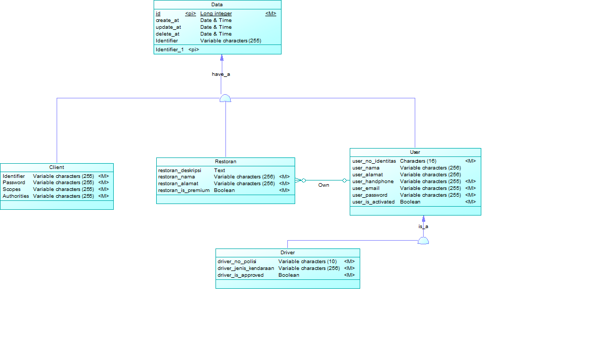

# API Documentation
```
Name :
Firman Maulana - 05111640000059
Affan Ghaffar -  05111640000121
Ananda Afryan -  05111640000147
```
# Data Model
## CDM

## PDM


# Driver API

## Structure
```
noIdentitas | String
noHandphone | String
nama | String
alamat | String
email | String
password | String
noPolisi | String
jenisKendaraan | String
isApproved | Boolean
```

## Show All Driver

* **URL:** `/drivers`
* **Method:** `GET` 
* **URL Parameters** 
`none`
* **Data Parameters** 
`none`
* **Sample Request**
```
{
    Request URL : 10.151.37.43:8080/drivers
}
```
* **Sample Output**
```
[
    {
        "id": 11,
        "created_at": "2019-05-06T16:29:58.000+0000",
        "deleted_at": null,
        "no_identitas": "333dd",
        "nama": null,
        "alamat": null,
        "no_handphone": "12333",
        "email": null,
        "is_activated": null,
        "no_polisi": "polisi222",
        "jenis_kendaraan": null,
        "is_approved": null
    },
    {
        "id": 14,
        "created_at": "2019-05-06T16:30:47.000+0000",
        "deleted_at": null,
        "no_identitas": "333dd3",
        "nama": null,
        "alamat": null,
        "no_handphone": "123333",
        "email": null,
        "is_activated": null,
        "no_polisi": "polisi222dd",
        "jenis_kendaraan": null,
        "is_approved": null
    }
]
```
* **Scope Limitation**
``` 
    read_driver
```

## Show Driver By Id

* **URL** `/drivers/{id}`
* **Menthod:** `GET`
* **URL Parameters**
`id=[Long]`
* **Data Parameters**
`none`
* **Sample Request**
```
    Request URL : 10.151.37.43:8080/drivers/11
```
* **Sample Output**
```
{
    "id": 11,
    "created_at": "2019-05-06T16:29:58.000+0000",
    "deleted_at": null,
    "no_identitas": "333dd",
    "nama": null,
    "alamat": null,
    "no_handphone": "12333",
    "email": null,
    "is_activated": null,
    "no_polisi": "polisi222",
    "jenis_kendaraan": null,
    "is_approved": null
}
```
* **Scope Limitation**
```
    read_driver
```
## Delete User

* **URL** `drivers/{id}`
* **Method:** `DELETE`
* **URL Parameters**
`id=[Long]`
* **Data Parameters**
`none`
* **Scope Limitation**
```
    delete_user
```

## Put Driver
* **URL** `drivers/{id}`
* **Method** `POST`
* **URL Parameters**
`id=[Long]`
* **Data Parameters**
> `noHandphone | String`
> `noIdentitas | String`
> `noPolisi | String`
* **Sample Request**
```
Body :
    {
        
    }
```
* **Scope Limitation**
```
    trust_driver
```

## Post Driver
* **URL** `/driver`
* **Method** `POST`
* **URL Parameters**
`id=[Long]`
* **Data Parameters**
> `noHandphone | String`
> `noIdentitas | String`
> `noPolisi | String`
* **Sample Request**
```
Body :
    {
        
    }
```
* **Sample Output**
```

```
* **Scope Limitation**
```
    trust_driver
```

## Patch Driver

* **URL** `drivers/{id}`
* **Method** `POST`
* **URL Parameters**
`id=[Long]`
* **Data Parameters**
> `noHandphone | String`
> `noIdentitas | String`
> `noPolisi | String`
* **Sample Request**
```
Body :
    {
        
    }
```
* **Sample Output**
```

```
* **Scope Limitation**
```
    write_driver
```

# Restaurant API

## Structure
```
nama | String
pemilik | User
deskripsi | String
alamat | String
isPremium | Boolean
```

## Show All Restaurant

* **URL:** `/restaurant`
* **Method:** `GET` 
* **URL Parameters**
`none`
* **Data Parameters**
`none`
* **Sample Request**
```
    Request URL: 10.151.37.43/restaurants
```
* **Sample Output**
```
[
    {
        "id": 15,
        "created_at": "2019-05-06T16:34:26.000+0000",
        "deleted_at": null,
        "pemilik": null,
        "nama": null,
        "deskripsi": null,
        "alamat": null,
        "is_premium": null
    },
    {
        "id": 16,
        "created_at": "2019-05-06T16:38:28.000+0000",
        "deleted_at": null,
        "pemilik": null,
        "nama": null,
        "deskripsi": null,
        "alamat": null,
        "is_premium": null
    },
    {
        "id": 17,
        "created_at": "2019-05-06T16:39:13.000+0000",
        "deleted_at": null,
        "pemilik": null,
        "nama": null,
        "deskripsi": null,
        "alamat": null,
        "is_premium": null
    },
    {
        "id": 18,
        "created_at": "2019-05-06T16:40:33.000+0000",
        "deleted_at": null,
        "pemilik": null,
        "nama": null,
        "deskripsi": null,
        "alamat": "333",
        "is_premium": null
    }
]
```
* **Scope Limitation**
```
    read_restaurant
```

## Show Restaurant By Id

* **URL** `/restaurant/{id}`
* **Menthod:** `GET`
* **URL Parameters**
`id=[Long]`
* **Data Parameters**
`none`
* **Sample Request**
```
    Request URL: 10.151.37.43/restaurant/15
```
* **Sample Output**
```
    {
        "id": 15,
        "created_at": "2019-05-06T16:34:26.000+0000",
        "deleted_at": null,
        "pemilik": null,
        "nama": null,
        "deskripsi": null,
        "alamat": null,
        "is_premium": null
    }
```
* **Scope Limitation**
```
    read_restaurant
```
## Delete Restaurant
* **URL** `restaurant/{id}`
* **Method:** `DELETE`
* **URL Parameters**
`id=[Long]`
* **Data Parameters**
`none`
* **Sample Request**
```
Body :
    {
        
    }
```
* **Sample Output**
```

```
* **Scope Limitation**
```
    delete_restaurant
```
## Put Restaurant

* **URL** `restaurant/{id}`
* **Method** `PUT`
* **URL Parameters**
`id=[Long]`
* **Data Parameters**
> `alamat | String`
* **Sample Request**
```
Body :
    {
        
    }
```
* **Sample Output**
```

```
* **Scope Limitation**
```
    trust_restaurant
```

## Post Restaurant

* **URL** `restaurant`
* **Method** `POST`
* **URL Parameters**
`none`
* **Data Parameters**
> `alamat | String`
* **Sample Request**
```
Body :
    {
        
    }
```
* **Sample Output**
```

```
* **Scope Limitation**
```
    trust_restaurant
```

## Patch Restaurant

* **URL** `restaurant/{id}`
* **Method** `POST`
* **URL Parameters**
`id=[Long]`
* **Data Parameters**
`none`
* **Sample Request**
```
Body :
    {
        
    }
```
* **Sample Output**
```

```
* **Scope Limitation**
```
    write_restaurant
```

# User API

## Structure
```
noIdentitas | String
noHandphone | String
nama | String
alamat | String
email | String
password | String
```

## Show All User

* **URL:** `/users`
* **Method:** `GET` 
* **URL Parameters**
`none`
* **Data Parameters**
`none`
* **Sample Request**
```
    Request URL: 10.151.37.43/users
```
* **Sample Output**
```
        [
        {
            "id": 20,
            "created_at": "2019-05-07T01:22:31.000+0000",
            "deleted_at": null,
            "no_identitas": "333222",
            "nama": "3131",
            "alamat": null,
            "no_handphone": "333",
            "email": null,
            "is_activated": null
        },
        {
            "id": 2,
            "created_at": "2019-05-06T14:48:34.000+0000",
            "deleted_at": null,
            "no_identitas": "123",
            "nama": null,
            "alamat": "Test Alamat",
            "no_handphone": "321",
            "email": "mail@gmail.com",
            "is_activated": null
        }
    ]
```
* **Scope Limitation**
```
    read_user
```

## Show User By Id

* **URL** `/users/{id}`
* **Menthod:** `GET`
* **URL Parameters**
`id=[Long]`
* **Data Parameters**
`none`
* **Sample Request**
```
    Request URL: 10.151.37.43/users/20
```
* **Sample Output**
```
        {
            "id": 20,
            "created_at": "2019-05-07T01:22:31.000+0000",
            "deleted_at": null,
            "no_identitas": "333222",
            "nama": "3131",
            "alamat": null,
            "no_handphone": "333",
            "email": null,
            "is_activated": null
        }
```
* **Scope Limitation**
```
    read_user
```

## Post User

* **URL** `/users`
* **Menthod:** `POST`
* **URL Parameters**
`none`
* **Data Parameters**
> `noIdentitas | String`
> `noHandphone | String`
* **Sample Request**
```
Body :
    {
        
    }
```
* **Sample Output**
```

```
* **Scope Limitation**
```
    trust_user
```

## Put User

* **URL** `/users/{id}`
* **Method:** `PUT`
* **URL Parameters**
`id=[Long] `
* **Data Parameters**
> `noIdentitas | String`
> `noHandphone | String`
* **Sample Request**
```
Body :
    {
        
    }
```
* **Sample Output**
```

```
* **Scope Limitation**
```
    trust_user
```

## Delete User

* **URL** `/users/{id}`
* **Method:** `DELETE`
* **URL Parameters**
`id=[Long]`
* **Data Parameters**
`none`
* **Sample Request**
```
Body :
    {
        
    }
```
* **Sample Output**
```

```
* **Scope Limitation**
```
    delete_user
```
