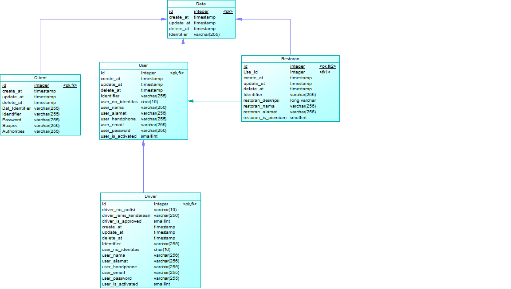

# API Documentation
```
Name :
Firman Maulana - 05111640000059
Affan Ghaffar -  05111640000121
Ananda Afryan -  05111640000147
```
# Data Model
## CDM

## PDM


# Developers
This service provide an implementation of OAuth2 standard. Please use the password grant, and refresh token grant inorder to obtain your access key. Read more about password grant here : https://www.oauth.com/oauth2-servers/access-tokens/password-grant/. Please use basic authentication to access our token endpoints. 
```
***host*** might be replaced with something else
host/oauth/token        //For retreiving your token
host/oauth/check_token  //For resources server that wants to check given token
```
Here is some diagrams for you :>. But please skip the user login form part since we just provide an API Endpoint. 


## Resource Access
Inorder to access resources that is registered on this service please contact one of our team members to get your `access credentials` to be used for password grant flow. Also some endpoints may require you to have the required scope to be able to access it. Let's assume that there is only one user in our service and that is `customer` with password `customer` to simplify our access.

## Resource Provider
If you want to register your service to us, please contact one of our team members so your service can be registered for token checking. Also, you are responsible for your own resources since we only provide token checking service.

# Driver API

## Structure
```
noIdentitas | String
noHandphone | String
nama | String
alamat | String
email | String
password | String
noPolisi | String
jenisKendaraan | String
isApproved | Boolean
```

## Show All Driver

* **URL:** `/drivers`
* **Method:** `GET` 
* **URL Parameters** 
`none`
* **Data Parameters** 
`none`
* **Sample Request**
```
{
    Request URL : 10.151.37.43:8080/drivers
}
```
* **Sample Output**
```
[
    {
        "id": 11,
        "created_at": "2019-05-06T16:29:58.000+0000",
        "deleted_at": null,
        "no_identitas": "333dd",
        "nama": null,
        "alamat": null,
        "no_handphone": "12333",
        "email": null,
        "is_activated": null,
        "no_polisi": "polisi222",
        "jenis_kendaraan": null,
        "is_approved": null
    },
    {
        "id": 14,
        "created_at": "2019-05-06T16:30:47.000+0000",
        "deleted_at": null,
        "no_identitas": "333dd3",
        "nama": null,
        "alamat": null,
        "no_handphone": "123333",
        "email": null,
        "is_activated": null,
        "no_polisi": "polisi222dd",
        "jenis_kendaraan": null,
        "is_approved": null
    }
]
```
* **Scope Limitation**
``` 
    read_driver
```

## Show Driver By Id

* **URL** `/drivers/{id}`
* **Menthod:** `GET`
* **URL Parameters**
`id=[Long]`
* **Data Parameters**
`none`
* **Sample Request**
```
    Request URL : 10.151.37.43:8080/drivers/11
```
* **Sample Output**
```
{
    "id": 11,
    "created_at": "2019-05-06T16:29:58.000+0000",
    "deleted_at": null,
    "no_identitas": "333dd",
    "nama": null,
    "alamat": null,
    "no_handphone": "12333",
    "email": null,
    "is_activated": null,
    "no_polisi": "polisi222",
    "jenis_kendaraan": null,
    "is_approved": null
}
```
* **Scope Limitation**
```
    read_driver
```
## Delete User

* **URL** `drivers/{id}`
* **Method:** `DELETE`
* **URL Parameters**
`id=[Long]`
* **Data Parameters**
`none`
* **Sample Request**
```
    Request URL: https://rendoru.com/kuliah/pbkk/users/6
    With DELETE method
```
* **Sample Output**
```
{
    "timestamp": "2019-05-13T17:53:07.217+0000",
    "status": 404,
    "error": "Not Found",
    "message": "No message available",
    "path": "/6"
}
```
* **Scope Limitation**
```
    delete_user
```

## Put Driver
* **URL** `drivers/{id}`
* **Method** `PUT`
* **URL Parameters**
`id=[Long]`
* **Data Parameters**
> `noHandphone | String`
> `noIdentitas | String`
> `noPolisi | String`
* **Sample Request**
```
Body :
    {
        "alamat": "Test Almamater",
        "jenis_kendaraan": motor
    }
```
* **Sample Output**
```
```
* **Scope Limitation**
```
    trust_driver
```

## Post Driver
* **URL** `/driver`
* **Method** `POST`
* **URL Parameters**
`id=[Long]`
* **Data Parameters**
> `noHandphone | String`
> `noIdentitas | String`
> `noPolisi | String`
* **Sample Request**
```
<<<<<<< HEAD
Body :
    {
        "no_identitas": "12344",
        "nama": null,
        "alamat": "Test Alamart",
        "no_handphone": "32114",
        "email": "maile@gmail.com",
        "no_polisi": "b3413d",
        "jenis_kendaraan": mobil
    }
=======
    drivers?noHandphone=085123456789&noPolisi=c1234d&noIdentitas=12345324
>>>>>>> master
```
* **Sample Output**
```
{
    "id": 6,
    "created_at": "2019-05-13T17:32:18.714+0000",
    "deleted_at": null,
    "no_identitas": "12345324,45685321",
    "nama": null,
    "alamat": null,
    "no_handphone": "085123456789",
    "email": null,
    "is_activated": null,
    "no_polisi": "c1234d,b1234xx",
    "jenis_kendaraan": null,
    "is_approved": null
}
```
* **Scope Limitation**
```
    trust_driver
```

## Patch Driver

* **URL** `drivers/{id}`
* **Method** `POST`
* **URL Parameters**
`id=[Long]`
* **Data Parameters**
> `noHandphone | String`
> `noIdentitas | String`
> `noPolisi | String`
* **Sample Request**
```
Body :
    {
        
    }
```
* **Sample Output**
```

```
* **Scope Limitation**
```
    write_driver
```

# Restaurant API

## Structure
```
nama | String
pemilik | User
deskripsi | String
alamat | String
isPremium | Boolean
```

## Show All Restaurant

* **URL:** `/restaurant`
* **Method:** `GET` 
* **URL Parameters**
`none`
* **Data Parameters**
`none`
* **Sample Request**
```
    Request URL: 10.151.37.43/restaurants
```
* **Sample Output**
```
[
    {
        "id": 15,
        "created_at": "2019-05-06T16:34:26.000+0000",
        "deleted_at": null,
        "pemilik": null,
        "nama": null,
        "deskripsi": null,
        "alamat": null,
        "is_premium": null
    },
    {
        "id": 16,
        "created_at": "2019-05-06T16:38:28.000+0000",
        "deleted_at": null,
        "pemilik": null,
        "nama": null,
        "deskripsi": null,
        "alamat": null,
        "is_premium": null
    },
    {
        "id": 17,
        "created_at": "2019-05-06T16:39:13.000+0000",
        "deleted_at": null,
        "pemilik": null,
        "nama": null,
        "deskripsi": null,
        "alamat": null,
        "is_premium": null
    },
    {
        "id": 18,
        "created_at": "2019-05-06T16:40:33.000+0000",
        "deleted_at": null,
        "pemilik": null,
        "nama": null,
        "deskripsi": null,
        "alamat": "333",
        "is_premium": null
    }
]
```
* **Scope Limitation**
```
    read_restaurant
```

## Show Restaurant By Id

* **URL** `/restaurant/{id}`
* **Menthod:** `GET`
* **URL Parameters**
`id=[Long]`
* **Data Parameters**
`none`
* **Sample Request**
```
    Request URL: 10.151.37.43/restaurant/15
```
* **Sample Output**
```
    {
        "id": 15,
        "created_at": "2019-05-06T16:34:26.000+0000",
        "deleted_at": null,
        "pemilik": null,
        "nama": null,
        "deskripsi": null,
        "alamat": null,
        "is_premium": null
    }
```
* **Scope Limitation**
```
    read_restaurant
```
## Delete Restaurant
* **URL** `restaurant/{id}`
* **Method:** `DELETE`
* **URL Parameters**
`id=[Long]`
* **Data Parameters**
`none`
* **Sample Request**
```
    Request URL:  https://rendoru.com/kuliah/pbkk/drivers/6
    with DELETE method
```
* **Sample Output**
```

```
* **Scope Limitation**
```
    delete_restaurant
```
## Put Restaurant

* **URL** `restaurant/{id}`
* **Method** `PUT`
* **URL Parameters**
`id=[Long]`
* **Data Parameters**
> `alamat | String`
* **Sample Request**
```
Body :
    {
        "pemilik": hasan,
        "nama": hisana,
        "deskripsi": ayam enak,
        "alamat": "jalan raya ciputra",
    }
```
* **Sample Output**
```

```
* **Scope Limitation**
```
    trust_restaurant
```

## Post Restaurant

* **URL** `restaurant`
* **Method** `POST`
* **URL Parameters**
`none`
* **Data Parameters**
> `alamat | String`
* **Sample Request**
```
<<<<<<< HEAD
Body :
    {
        "pemilik": hasan,
        "nama": hisana,
        "deskripsi": ayam enak,
        "alamat": "jalan raya ciputra",
        "is_premium": null
    }
=======
/restaurants?alamat=jalan raya kebagusan city   
>>>>>>> master
```
* **Sample Output**
```
{
    "id": 14,
    "created_at": "2019-05-13T17:36:10.859+0000",
    "deleted_at": null,
    "pemilik": null,
    "nama": null,
    "deskripsi": null,
    "alamat": "jalan raya kebagusan city",
    "is_premium": null
}
```
* **Scope Limitation**
```
    trust_restaurant
```

## Patch Restaurant

* **URL** `restaurant/{id}`
* **Method** `POST`
* **URL Parameters**
`id=[Long]`
* **Data Parameters**
`none`
* **Sample Request**
```
Body :
    {
        
    }
```
* **Sample Output**
```

```
* **Scope Limitation**
```
    write_restaurant
```

# User API

## Structure
```
noIdentitas | String
noHandphone | String
nama | String
alamat | String
email | String
password | String
```

## Show All User

* **URL:** `/users`
* **Method:** `GET` 
* **URL Parameters**
`none`
* **Data Parameters**
`none`
* **Sample Request**
```
    Request URL: 10.151.37.43/users
```
* **Sample Output**
```
        [
        {
            "id": 20,
            "created_at": "2019-05-07T01:22:31.000+0000",
            "deleted_at": null,
            "no_identitas": "333222",
            "nama": "3131",
            "alamat": null,
            "no_handphone": "333",
            "email": null,
            "is_activated": null
        },
        {
            "id": 2,
            "created_at": "2019-05-06T14:48:34.000+0000",
            "deleted_at": null,
            "no_identitas": "123",
            "nama": null,
            "alamat": "Test Alamat",
            "no_handphone": "321",
            "email": "mail@gmail.com",
            "is_activated": null
        }
    ]
```
* **Scope Limitation**
```
    read_user
```

## Show User By Id

* **URL** `/users/{id}`
* **Menthod:** `GET`
* **URL Parameters**
`id=[Long]`
* **Data Parameters**
`none`
* **Sample Request**
```
    Request URL: 10.151.37.43/users/20
```
* **Sample Output**
```
        {
            "id": 20,
            "created_at": "2019-05-07T01:22:31.000+0000",
            "deleted_at": null,
            "no_identitas": "333222",
            "nama": "3131",
            "alamat": null,
            "no_handphone": "333",
            "email": null,
            "is_activated": null
        }
```
* **Scope Limitation**
```
    read_user
```

## Post User

* **URL** `/users`
* **Menthod:** `POST`
* **URL Parameters**
`none`
* **Data Parameters**
> `noIdentitas | String`
> `noHandphone | String`
* **Sample Request**
```
Body :
    {
        "no_identitas": "12344",
        "nama": null,
        "alamat": "Test Alamart",
        "no_handphone": "32114",
        "email": "maile@gmail.com"
    }
```
* **Sample Output**
```

```
* **Scope Limitation**
```
    trust_user
```

## Put User

* **URL** `/users/{id}`
* **Method:** `PUT`
* **URL Parameters**
`id=[Long] `
* **Data Parameters**
> `noIdentitas | String`
> `noHandphone | String`
* **Sample Request**
```
Body :
    {
        "no_identitas": "12344",
        "nama": "Jaenuddin",
        "alamat": "Test Alamart", 
    }
```
* **Sample Output**
```

```
* **Scope Limitation**
```
    trust_user
```

## Delete User

* **URL** `/users/{id}`
* **Method:** `DELETE`
* **URL Parameters**
`id=[Long]`
* **Data Parameters**
`none`
* **Sample Request**
```
    Request URL:  https://rendoru.com/kuliah/pbkk/users/1
    With DELETE request
```
* **Sample Output**
```

```
* **Scope Limitation**
```
    delete_user
```
# Clients API

## Structure
```
identifier | String
secret | string
scopes | string
```

## Show All Clients
* **URL:** `/clients`
* **Method:** `GET` 
* **URL Parameters**
`none`
* **Data Parameters**
`none`
* **Sample Request**
```
    Request URL:  https://rendoru.com/kuliah/pbkk/clients
```
* **Sample Output**
```
    [
    {
        "id": 1,
        "created_at": null,
        "deleted_at": null,
        "identifier": "admin-svc",
        "scopes": "delete_client read_client write_client   trust_client read_user write_user trust_user delete_user read_restaurant write_restaurant trust_restaurant delete_restaurant read_driver write_driver trust_driver delete_driver"
    },
    {
        "id": 2,
        "created_at": null,
        "deleted_at": null,
        "identifier": "read-user",
        "scopes": "read_user"
    },
    {
        "id": 3,
        "created_at": null,
        "deleted_at": null,
        "identifier": "resource",
        "scopes": "none"
    }
]
```

## Show Clients by ID
* **URL:** `/clients/{id}`
* **Method:** `GET` 
* **URL Parameters**
`id = [Long]`
* **Data Parameters**
`none`
* **Sample Request**
```
    Request URL:  https://rendoru.com/kuliah/pbkk/clients/2
```
* **Sample Output**
```
{
    "id": 2,
    "created_at": null,
    "deleted_at": null,
    "identifier": "read-user",
    "scopes": "read_user"
}
```

## Put Clients
* **URL:** `/clients/`
* **Method:** `PUT` 
* **URL Parameters**
`none`
* **Data Parameters**
`identifier = [String]`
* **Sample Request**
```
```
* **Sample Output**
```
```

## Post Clients
* **URL:** `/clients/`
* **Method:** `POST` 
* **URL Parameters**
`none`
* **Data Parameters**
`identifier = [String]`
* **Sample Request**
```
```
* **Sample Output**
```
```

## Delete Clients
* **URL:** `/clients/{id}`
* **Method:** `DELETE` 
* **URL Parameters**
`id = [Long]`
* **Data Parameters**
`none`
* **Sample Request**
```
    Request URL:  https://rendoru.com/kuliah/pbkk/clients/2
    With DELETE request
```
* **Sample Output**
```
```

## Patch Clients
* **URL:** `/clients/`
* **Method:** `POST` 
* **URL Parameters**
`none`
* **Data Parameters**
`identifier = [String]`
* **Sample Request**
```
```
* **Sample Output**
```
```
